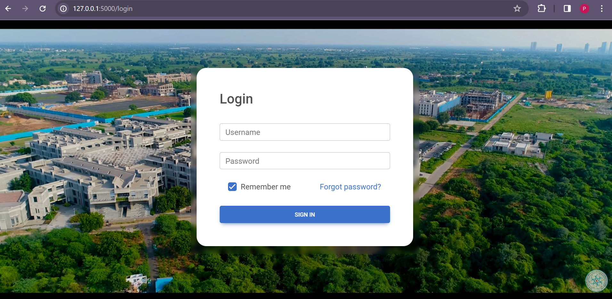
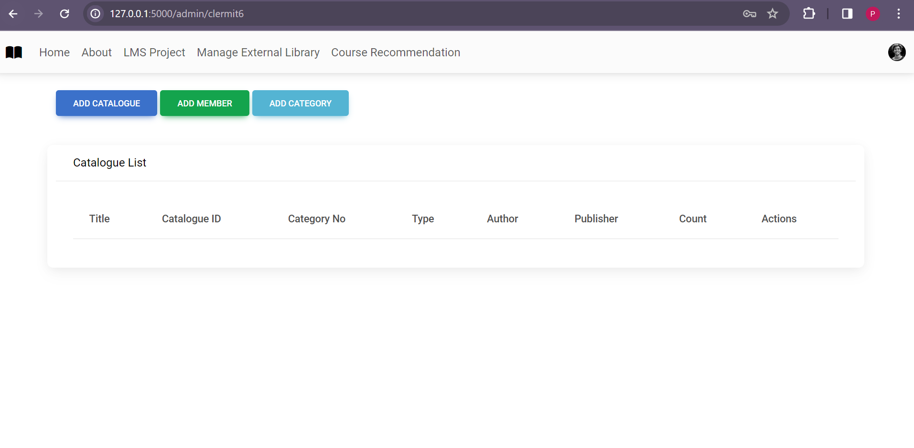
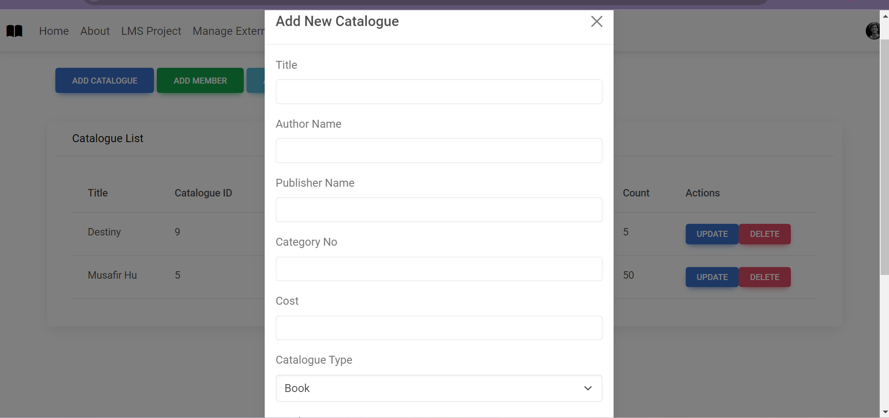
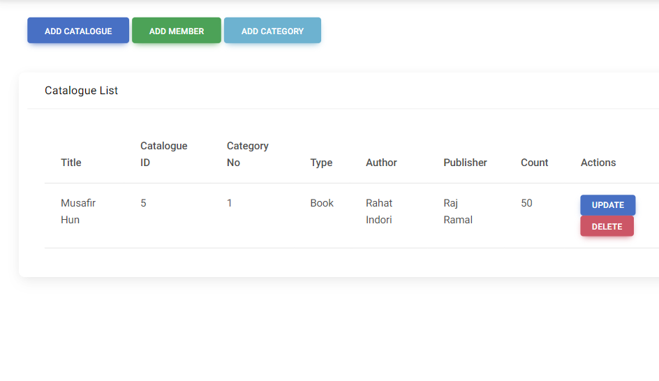
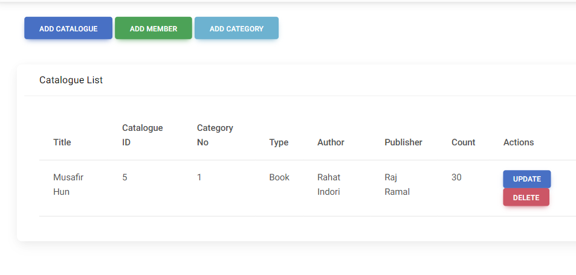
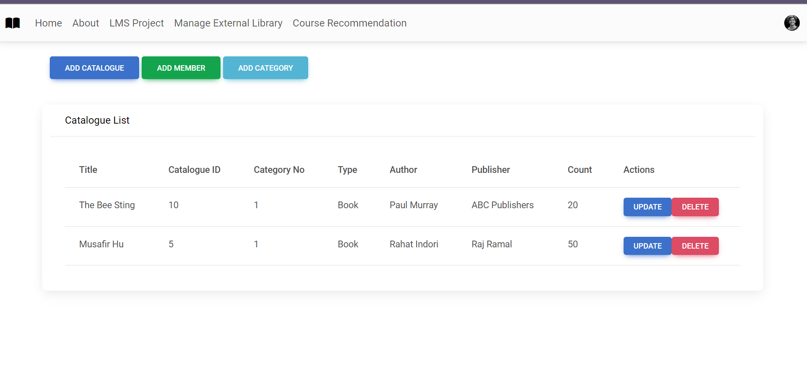
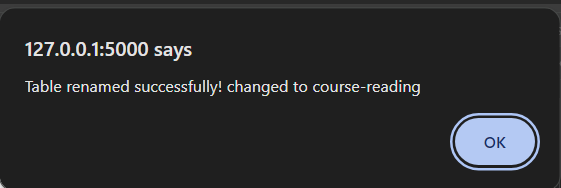
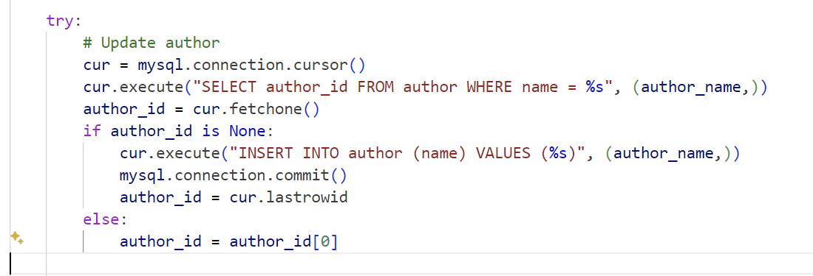

<div style="text-align: center;">
    <h1>CS 432 : DATABASES</h1>
    <h2>LIBRARY MANAGEMENT SYSTEM</h2>
    

**ASSIGNMENT 3**

**GROUP MEMBERS**
</div>
<table align="center" style="width: 70%;">
    <tr>
        <th>Name</th>
        <th>Roll Number</th>
    </tr>
    <tr>
        <td>Aashmun Gupta</td>
        <td>22110005</td>
    </tr>
    <tr>
        <td>Anmol Kumar</td>
        <td>22110028</td>
    </tr>
    <tr>
        <td>Anushri Sanodia</td>
        <td>22110030</td>
    </tr>
    <tr>
        <td>Deepanjali Kumari</td>
        <td>22110069</td>
    </tr>
    <tr>
        <td>Dhruv Sharma</td>
        <td>22110074</td>
    </tr>
    <tr>
        <td>Pavani Khale</td>
        <td>22110191</td>
    </tr>
    <tr>
        <td>Yash Patel</td>
        <td>21110243</td>
    </tr>
</table>

### Configuration Setup
In `config.py`, ensure to set up the following variables:

```python
MYSQL_HOST = 'localhost'
MYSQL_USER = 'root'
MYSQL_PASSWORD = '<password>'
MYSQL_DB = 'Library'

SECRET_KEY = '123456789'
```

### Dependencies
Make sure to install the required dependencies in your virtual environment using the following commands:

```bash
pip install Flask
pip install Flask-mysqldb
```

### Database Table
The application utilizes the 'users' table.

### Generating SECRET_KEY:
You can generate a secure secret key by running the following Python script:

```python
import secrets

secret_key = secrets.token_hex(16)
print("Generated Secret Key:", secret_key)
```

### Creating a Virtual Environment
If you haven't set up a virtual environment (`pyvenv`), you can do so using the following command:

```bash
python -m venv your_venv_name
```

Activate the virtual environment:

- On Windows:
```bash
your_venv_name\Scripts\activate
```
- On Unix or MacOS:
```bash
source your_venv_name/bin/activate
```

### Running the Application
To start the Flask application, execute `flask run` in your terminal.

### Cloning Repository
To get started with the project, clone the repository from the following URL:

```bash
git clone https://github.com/AshStorm17/CS432
```

### **3.1 Responsibilty of G1:**:
1. In this we worked on creating the corresponding routes for the features created in the frontend .
2. Integrated our Library System database with the Webapp.
3. Created a dynamic programme which can insert, modify and delete the information as per the need by the admin.


### **3.2 Responsibilty of G1:**:
1. We made the login interface and admin view, adding functions in the admin view like update, edit, and delete, i.e., modifications like these are shown.
2. Made faculty view where only faculty can view it for adding course recommendations.
3. Made student view along with catalog search, where student can see what books he/she has already issued previously.


### **3.3 Responsibility of G1 and G2:**

**FUNCTIONS :**

HOME PAGE :


LOGIN PAGE :



1. **INSERT :**

Inserting a new catalogue:





BEFORE INSERTING NEW RECORD :


AFTER INSERTING NEW CATALOGUE :


2. **UPDATE  :**

Before Updating Count:



After Updating Count:




3. **DELETE :**

Deleting the catalogue Destiny.



4. **RENAME :**

We added a button to demonstrate RENAME function on a table name.


After button click, We get




5. **WHERE CLAUSE :**

WHERE clause is used in Updating/Inserting the Author name in the database.




**CONTRIBUTIONS:**

1. **Aashmun Gupta (G2)** -
Worked on Backend development.

2. **Anmol Kumar (G1 and G2)** -
Worked on both Frontend and Backend development.

3. **Anushri Sanodia (G1)** -
Worked on Frontend Development.

4. **Deepanjali Kumari (G1)-**.
Worked on Frontend Development.

5. **Dhruv Sharma (G2) -**
Worked on Backend development.

6. **Pavani Khale (G2) -**
Worked on Backend development.

7. **Yash Patel (G1) -**
Worked on Frontend Development.

